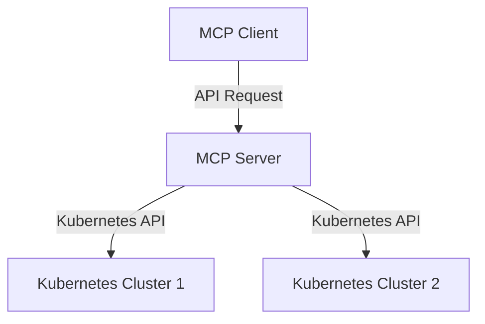

# Building a Kubernetes MCP Server: Architecture, Implementation, and Usage

## Introduction
In today's cloud-native world, managing multiple Kubernetes clusters can be challenging. To address this, I built the `k8s-mcp-server`, a Python-based control plane that simplifies multi-cluster management by providing a unified API to interact with Kubernetes resources. This blog post covers the architecture, technical details, usage, and code examples for this project.

*If you find this project interesting, don't forget to connect with me on [GitHub](https://github.com/yourusername) and [LinkedIn](https://www.linkedin.com/in/your-linkedin-profile)!*

---

## What is MCP?
**MCP** stands for **Management Control Plane**. It acts as a central server that interacts with one or more Kubernetes clusters, exposing APIs for clients (CLI tools, dashboards, or other services) to manage deployments, pods, services, and more.

- **MCP Server:** The backend service that talks to Kubernetes clusters.
- **MCP Client:** Any tool or script that sends requests to the MCP Server to perform operations.

---

## Architecture Overview



- **MCP Client:** Sends REST/gRPC requests to the MCP Server.
- **MCP Server:** Handles requests, authenticates, and interacts with Kubernetes clusters.
- **Kubernetes Clusters:** The actual clusters being managed.

---

## Technical Details
- **Language:** Python 3.8+
- **Key Libraries:** `kubernetes` Python client, (optionally FastAPI/Flask for API exposure)
- **Modules:**
  - `k8s_client.py`: Handles Kubernetes API interactions.
  - `k8s_deployments.py`, `k8s_pods.py`, `k8s_services.py`, etc.: Resource-specific logic.
  - `main.py`: Entry point for the server.
  - `k8s_utils.py`: Utility functions for Kubernetes operations.

### Example: Listing Pods
```python
from src.k8s_pods import list_pods

pods = list_pods(namespace="default")
for pod in pods:
    print(pod.metadata.name)
```

---

## How to Use the MCP Server

### Prerequisites
- Python 3.8+
- Access to Kubernetes clusters (kubeconfig)
- Docker (optional, for containerized deployment)

### Installation
```bash
git clone https://github.com/yourusername/k8s-mcp-server.git
cd k8s-mcp-server
pip install -r requirements.txt
```

### Running the Server
```bash
python src/main.py
```

### Example API Call
```bash
curl http://localhost:8000/pods?namespace=default
```

---

## Code Snippets & Examples

### Deploying a Service
```python
from src.k8s_services import create_service

service_manifest = {...}  # Define your Kubernetes service manifest here
create_service(namespace="default", manifest=service_manifest)
```

### Listing Deployments
```python
from src.k8s_deployments import list_deployments

deployments = list_deployments(namespace="default")
for dep in deployments:
    print(dep.metadata.name)
```

### Listing ReplicaSets
```python
from src.k8s_replicasets import list_replicasets

replicasets = list_replicasets(namespace="default")
for rs in replicasets:
    print(rs.metadata.name)
```

### Utility Example: Loading Kubeconfig
```python
from src.k8s_utils import load_kube_config

load_kube_config()  # Loads kubeconfig for cluster access
```

---

## Advanced Usage
- **Multi-Cluster Management:** Configure the MCP server to connect to multiple clusters by updating your kubeconfig or extending the client logic.
- **Extending Resources:** Add new modules for additional Kubernetes resources as needed.
- **Containerization:** Use the provided Dockerfile to build and run the MCP server as a container.

### Docker Example
```bash
docker build -t k8s-mcp-server .
docker run -p 8000:8000 -v ~/.kube:/root/.kube k8s-mcp-server
```

---

## Conclusion
The `k8s-mcp-server` project streamlines multi-cluster Kubernetes management, making it easier for teams to operate at scale. It's modular, extensible, and easy to use. Contributions are welcome—feel free to fork the repo and submit pull requests!

*If you enjoyed this post or found it useful, please star the repository and connect with me on social media!*

---

## Connect & Follow

- **GitHub:** [https://github.com/yourusername](https://github.com/yourusername)
- **LinkedIn:** [https://www.linkedin.com/in/your-linkedin-profile](https://www.linkedin.com/in/your-linkedin-profile)

Stay tuned for more tech content, project updates, and Kubernetes tips!

---

## Further Reading & Contribution
- [Kubernetes Python Client Documentation](https://github.com/kubernetes-client/python)
- [Official Kubernetes Documentation](https://kubernetes.io/docs/)
- [Your Project Repository](https://github.com/yourusername/k8s-mcp-server)

---

*Happy Hacking!* 